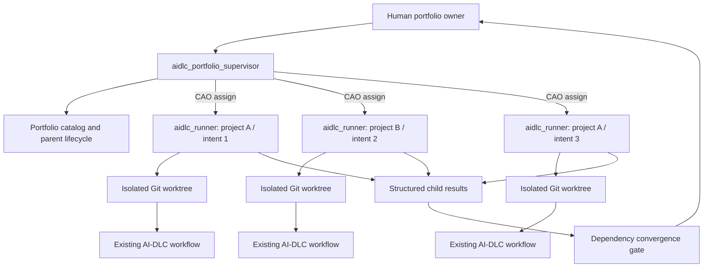

# AI-DLC Portfolio Example

This example shows how CAO can coordinate several AI-DLC workflows across
repositories, or several independent intents in one repository, without
changing the child AI-DLC engine.

## The Problem This Addresses

AI-DLC is effective at driving one development intent through its lifecycle.
Real product changes, however, often cross repository boundaries:

- an API change in one repository requires a client change in another;
- a data migration must complete before an application release;
- infrastructure and application repositories must agree on deployment order;
- two business capabilities share a contract or operational dependency.

A child agent can inspect another repository or retrieve relevant facts from a
knowledge system such as CodeKB. That improves what the agent knows, but
knowledge is not coordination. It does not determine:

- which project owns a change;
- which intent should wait for another;
- whether a contract change is compatible;
- who accepts an unresolved cross-project risk;
- when independently successful branches are safe to integrate.

A single AI-DLC workflow is not a portfolio scheduler. Asking one child workflow
to jump between repositories also mixes ownership, lifecycle state, and
verification evidence. Parallel child workflows solve the execution bottleneck,
but they still need a durable parent that understands project relationships.

### Parallel Work In One Repository

Independent changes in one repository can run as separate AI-DLC intents in
separate Git worktrees. With one worktree and one AI-DLC state area per intent,
the children do not inherently share one execution cursor.

The remaining conflict is at the shared project boundary. Children can produce
divergent `project.md` or `team.md` updates, make incompatible assumptions about
the same component, or reach integration in the wrong order. If workflows share
an intent directory or mutable AI-DLC state instead of isolating it, they can
also overwrite each other's lifecycle position.

This example addresses both cases:

- isolate child execution by project, intent, branch, and worktree;
- keep AI-DLC authoritative inside each child workflow;
- add one portfolio supervisor for dependencies, human decisions, shared
  memory, and integration convergence.

## Architecture



The parent lifecycle is:

```text
Bootstrap -> Discover -> Confirm -> Plan -> Dispatch -> Integrate -> Learn
```

It does not replace or infer child AI-DLC stages.

## What The Example Provides

- `aidlc_portfolio_supervisor.md`: Opus supervisor that discovers portfolio
  context and launches child sessions with CAO `assign`.
- `aidlc_runner.md`: Opus worker that owns exactly one AI-DLC intent and
  worktree.
- `skills/aidlc-portfolio/`: managed skill containing schemas, templates,
  reference guidance, and a deterministic portfolio CLI.
- `tests/`: focused tests for workspace validation, harness projection,
  lifecycle gates, shared-memory serialization, and dependency convergence.

The deterministic utility provides:

- a catalog of business outcomes, capabilities, projects, components, and
  eight dependency types;
- revision-bound human confirmation before dispatch;
- one Git worktree and child session record per project/intent pair;
- unanswered Markdown question packets for child design decisions;
- a single-writer proposal model for shared AI-DLC memory;
- structured child completion results and cycle-safe upstream/downstream
  convergence checks.

## Prerequisites

- CAO installed from the current `main` branch.
- `cao-server` running.
- Bun 1.3 or later.
- Git.
- Claude Code installed and authenticated.
- A built Claude AI-DLC distribution at
  `$HOME/Project/aidlc-workflows/dist/claude`.

The profiles use Claude Code's `opus` selector. The harness projection pins the
child runtime to the configured Opus 5 model identifier.

Both profiles explicitly allow CAO orchestration, shell execution, and
workspace file access because they must run the deterministic utility and write
inside assigned worktrees. Their prompts provide the narrower supervisor and
single-intent ownership boundaries.

## Install

From the CAO repository root:

```bash
cd examples/aidlc-portfolio

# Install dependencies used by the example tests.
bun install --frozen-lockfile

# Install the managed skill, then its runtime-only Bun dependencies.
cao skills add ./skills/aidlc-portfolio
bun install \
  --cwd "$HOME/.aws/cli-agent-orchestrator/skills/aidlc-portfolio" \
  --frozen-lockfile --production

# Install both CAO profiles.
cao install ./aidlc_portfolio_supervisor.md
cao install ./aidlc_runner.md
```

Use `cao skills add ./skills/aidlc-portfolio --force` when intentionally
updating an earlier installation.

Validate the installation source:

```bash
cao profile validate ./aidlc_portfolio_supervisor.md
cao profile validate ./aidlc_runner.md
cao skills list
```

## Launch

Create and enter an empty parent directory. The supervisor owns everything
inside this directory, including repository checkouts, portfolio state, and
worktrees.

```bash
mkdir -p /absolute/path/to/my-portfolio
cd /absolute/path/to/my-portfolio
cao launch --agents aidlc_portfolio_supervisor
```

Do not launch the supervisor from an existing project checkout. It creates this
layout:

```text
my-portfolio/
|-- portfolio/
|   |-- portfolio.yaml
|   |-- state.json
|   |-- projects/
|   |-- dependencies/
|   |-- contracts/
|   |-- intents/
|   |-- questions/
|   |-- learnings/
|   |-- results/
|   `-- convergence-decisions/
|-- repositories/
|-- harness/
`-- worktrees/
```

## Try A Cross-Repository Portfolio

Give the supervisor concrete repositories and work items:

```text
Coordinate these changes as one AI-DLC portfolio:

- checkout-api, issue 142: add the v2 checkout response contract
- checkout-web, issue 87: consume the v2 checkout response
- checkout-infra, issue 31: deploy the API before the web release

Discover the business and technical relationships with me, create one child
intent and worktree per project, and run dependency-ready children in parallel.
Do not accept unknown or breaking integration risks without asking me.
```

The supervisor should:

1. initialize the launch directory;
2. clone fresh canonical repositories under `repositories/`;
3. discover and confirm business, component, contract, and dependency context;
4. create isolated worktrees and project the same AI-DLC harness into each;
5. launch dependency-ready `aidlc_runner` sessions concurrently;
6. relay child design questions to the human without answering them;
7. require structured child results and resolve convergence before completion.

## Try Parallel Intents In One Repository

```text
Coordinate issues 321 and 510 in the same repository as independent AI-DLC
intents. Use a separate branch, worktree, and child session for each. Identify
shared components and integration dependencies before dispatch. Treat project
and team memory as single-writer shared state.
```

The two children have isolated files and AI-DLC state. They submit durable
project or team learnings as proposals; only the supervisor can serialize an
approved update into canonical memory.

## Human Control Points

Tool permission and AI autonomy do not replace product decisions. The sample
keeps the human involved at four boundaries:

1. **Discovery**: confirm organization, outcomes, capabilities, and dependency
   facts before dispatch.
2. **Child questions**: review AI-DLC-generated design questions through an
   unchanged Markdown packet.
3. **Convergence**: accept or resolve revision-bound breaking, deferred, or
   unknown integration risks.
4. **Shared memory**: review project/team learning proposals before the utility
   performs the canonical write.

Missing child results and incomplete dependency ordering cannot be accepted;
they must be remediated.

## Inspect And Recover

The supervisor normally runs these commands through the managed skill. They are
also useful when inspecting a stopped session:

```bash
SKILL_DIR="$HOME/.aws/cli-agent-orchestrator/skills/aidlc-portfolio"
ROOT=/absolute/path/to/my-portfolio

bun "$SKILL_DIR/scripts/portfolio.ts" doctor --root "$ROOT"
bun "$SKILL_DIR/scripts/portfolio.ts" lifecycle status --root "$ROOT"
bun "$SKILL_DIR/scripts/portfolio.ts" status --root "$ROOT"
bun "$SKILL_DIR/scripts/portfolio.ts" convergence check --root "$ROOT"
```

CAO terminals are disposable. Portfolio state, Git worktrees, and child AI-DLC
state are durable, so a replacement terminal resumes the same registered child
instead of creating a new intent.

## Verify The Example

```bash
cd examples/aidlc-portfolio
bun run check
```

The suite does not invoke a provider or perform real project development. It
tests the deterministic portfolio control plane with temporary Git
repositories and worktrees. CAO's main CI workflow runs the same command.

## Boundaries

This example does not:

- modify the AI-DLC engine or calculate its next stage;
- use CodeKB as a substitute for dependency ownership or integration policy;
- share one mutable AI-DLC state directory between children;
- automatically approve human design or integration decisions;
- reuse, clean, reset, or delete an existing user checkout.
